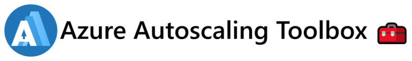

A toolbox to leverage observability for autoscaling in Microsoft Azure.

## Overview

- [Autoscalers](https//azure-autoscaling-toolbox.tomkerkhove.be/autoscalers/)
- [Observability](https//azure-autoscaling-toolbox.tomkerkhove.be/observability/)
- [Limitations](//https//azure-autoscaling-toolbox.tomkerkhove.be/limitations/)
- [Samples](https//azure-autoscaling-toolbox.tomkerkhove.be/samples/)

## License

This is licensed under The MIT License (MIT). Which means that you can use, copy, modify, merge, publish, distribute, sublicense, and/or sell copies of the web application. But you always need to state that Tom Kerkhove is the original author of this web application.
