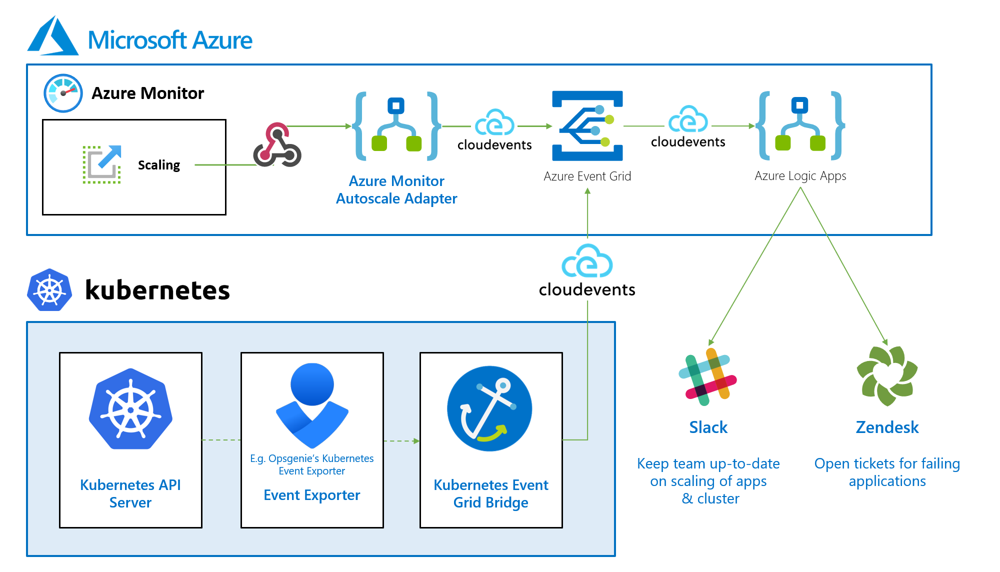

# Microsoft Azure Autoscaling Toolbox 🧰

A toolbox to leverage observability for autoscaling in Microsoft Azure.

## Overview

### Autoscalers

There are various options to scale Azure workloads and/or integrate with Azure:

- **Azure Cosmos DB Autoscale** - Autoscale throughput on database or collections. ([Docs](https://docs.microsoft.com/en-us/azure/cosmos-db/provision-throughput-autoscale))
- **Azure Monitor Autoscale** - Autoscaling-as-a-service ([Docs](https://docs.microsoft.com/en-us/azure/azure-monitor/autoscale/autoscale-overview))
  - Supported services include Azure API Management, App Service, Cloud Services, Data Explorer Clusters, Logic Apps, Service Bus, Spring Cloud, Virtual Machines Scale Sets, Web Apps. ([Full Overview](https://docs.microsoft.com/en-us/azure/azure-monitor/autoscale/autoscale-overview#supported-services-for-autoscale))
- **Autoscaling Kubernetes**
  - Cluster Autoscaler for Azure Kubernetes Service - Automatically scale a node pool in a Kubernetes cluster ([Docs](https://docs.microsoft.com/en-us/azure/aks/cluster-autoscaler))
  - Kubernetes Event-Driven Autoscaling (KEDA) - Kubernetes application autoscaling made simple ([GitHub](https://github.com/kedacore/keda) | [Docs](http://keda.sh/))
- **Bellhop** - Hop between Azure Resource service tiers based on time, like a traditional bellhop helps you move between floors in a hotel. ([GitHub](https://github.com/Azure/bellhop) | [Docs](https://azure.github.io/bellhop))

### Observability

Autoscaling is one thing, understanding how you are scaling is another.

Standardizing on Azure Event Grid is a great approach to centralize your autoscaling notifications:

Here are a few ways to integrate with Azure Monitor for your autoscaling:

- **Kubernetes Event Grid Bridge** - A simple event bridge for Kubernetes native events to Azure Event Grid. ([GitHub](https://github.com/tomkerkhove/k8s-event-grid-bridge) | [Docs](https://docs.k8s-event-grid-bridge.io/) | [Blog post](https://blog.tomkerkhove.be/2021/01/19/introducing-kubernetes-event-grid-bridge/))
- **Azure Event Grid adapter for Azure Monitor Autoscale** - Bring Azure Monitor Autoscale events to Azure Event Grid with this adapter. ([GitHub](https://github.com/tomkerkhove/azure-monitor-autoscale-to-event-grid-adapter) | [Blog post](https://blog.tomkerkhove.be/2021/02/10/automatically-forwarding-azure-monitor-autoscale-events-to-azure-event-grid/))

### Limitations

- Azure API Management will only autoscale the primary location in a multi-regional deployment scenario ([Docs](https://docs.microsoft.com/en-us/azure/api-management/api-management-howto-autoscale#azure-api-management-autoscale-limitations))

### Samples

Here are a few sample(s) on how to extend Azure:

- Autoscaling Azure Container Instances with Azure Serverless. ([GitHub](https://github.com/tomkerkhove/autoscale-aci-with-azure-serverless))

## License

This is licensed under The MIT License (MIT). Which means that you can use, copy, modify, merge, publish, distribute, sublicense, and/or sell copies of the web application. But you always need to state that Tom Kerkhove is the original author of this web application.
