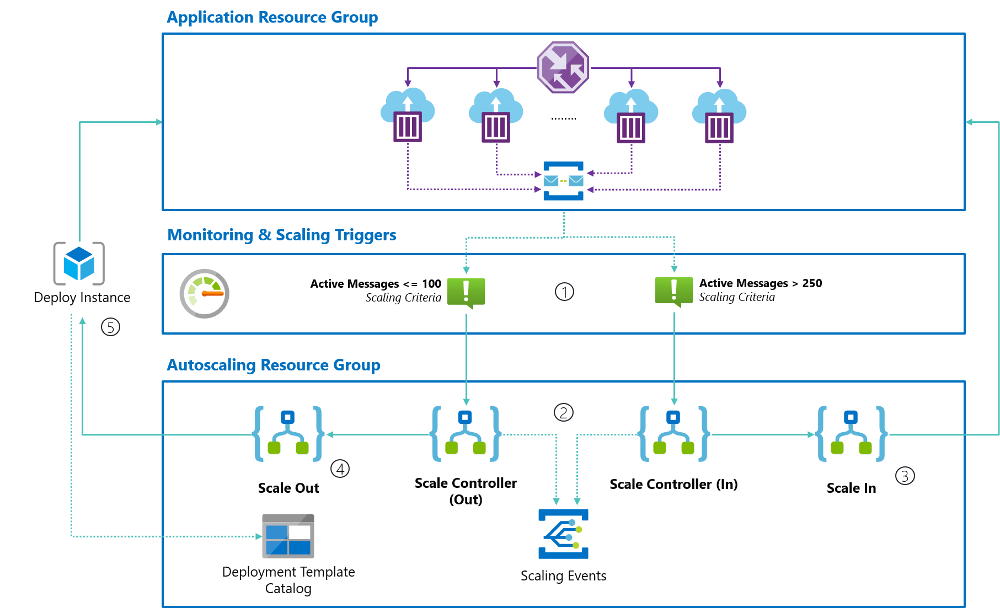

## Autoscaling Azure Container Instances with Azure Serverless

[Blog Post](https://blog.tomkerkhove.be/2021/01/02/autoscaling-azure-container-instances-with-azure-serverless/){: .btn }
[GitHub](https://github.com/tomkerkhove/autoscale-aci-with-azure-serverless){: .btn }

A proof-of-concept on how you can autoscale Azure Container Instance container groups in a resource group by using with Azure Serverless as a scaling infrastructure.

