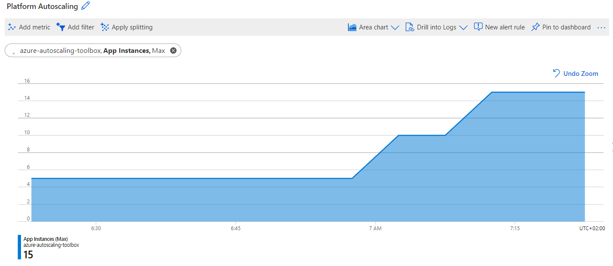
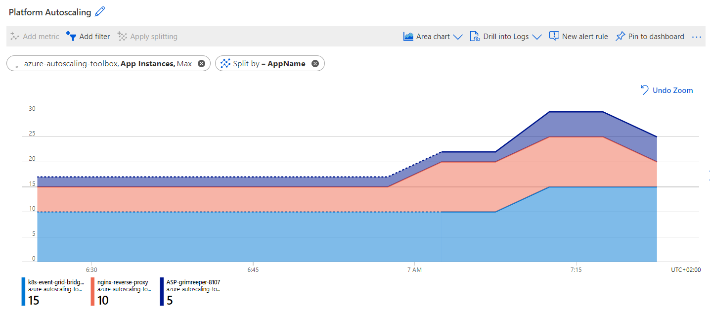
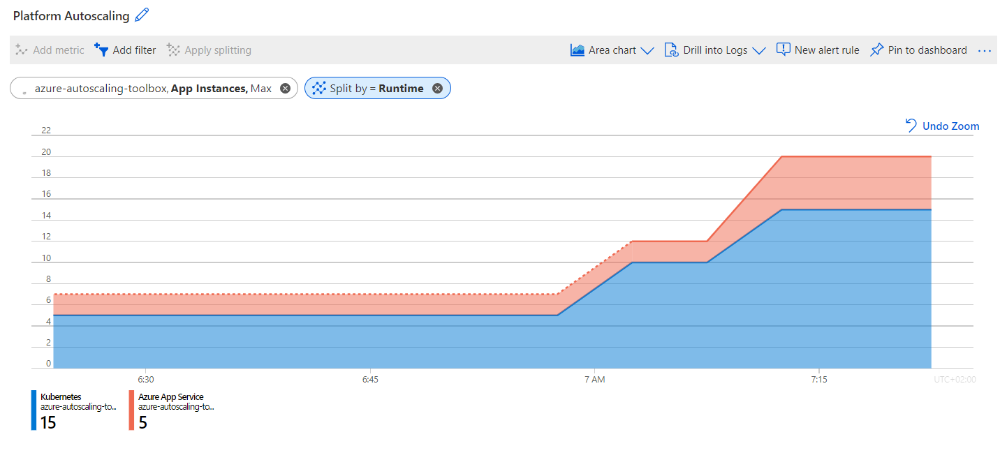
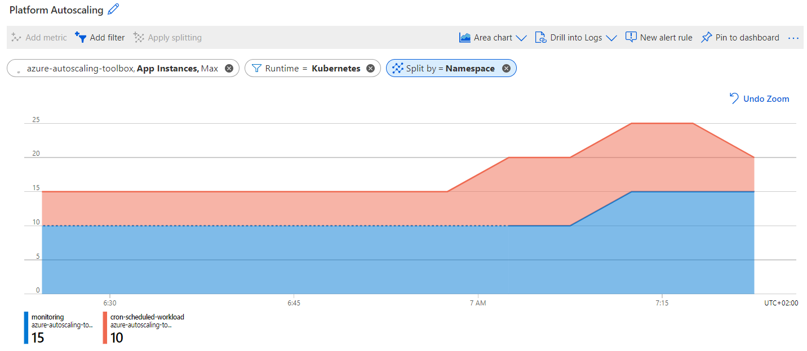
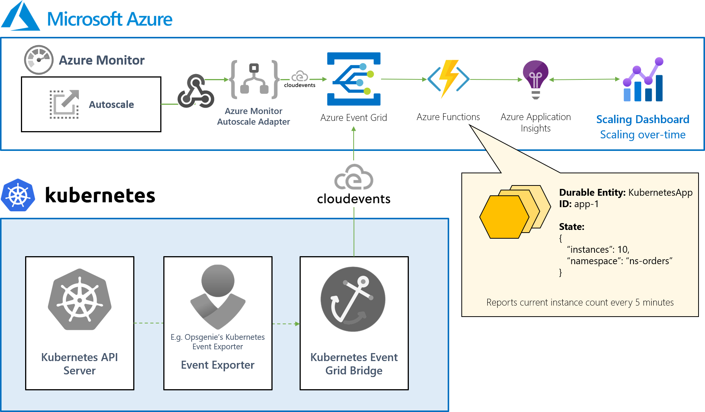

# Autoscaling-over-time Dashboard

Leverage scaling-over-time dashboarding for your application autoscaling with Azure Durable Functions. 📊


## What does it provide?

Use `App Instances` metrics to visualise how the applications in your platform are scaling.



Here are a few more examples:

<details>
  <summary>Instances per application</summary>
  


</details>

<details>
  <summary>Application Instances per runtime</summary>
  


</details>

<details>
  <summary>Application Instances per Kubernetes namespace</summary>
  


</details>

Learn more about the available dimensions below.

## How does it work?

For every application in your platform, a durable entity is available that allows you to:

- Receive CloudEvents for Azure Monitor Autoscale events (based on [Azure Event Grid adapter for Azure Monitor Autoscale](https://github.com/tomkerkhove/azure-monitor-autoscale-to-event-grid-adapter))
- Receive CloudEvents for Kubernetes application events (based on [Kubernetes Event Grid Bridge]([https://docs.k8](https://docs.k8s-event-grid-bridge.io/)))
- Automatically report current instance count every 5 minutes
- Get the current instance count for a given app

Here's a high-level overview:



## Gain deeper insights with dimensions

Want to have a more detailed overview? Use the various dimensions that are provided:

- For Kubernetes applications, we provide:
  - `AppName` - Name of the deployment in the cluster
  - `Namespace` - Name of the Kubernetes namespace
  - `Runtime` - Fixed to Kubernets

- For generic applications scaled with Azure Monitor, we provide:
  - `AppName` - Name of the Azure resource
  - `SubscriptionId` - Name of the Azure subscription
  - `ResourceGroup` - Name of the Azure resource group
  - `Region` - Name of the Azure region
  - `Runtime` - Name or type of Azure service hosting your application, for example `Azure App Service`

## API Overview

Here is an overview of the APIs you can interact with.

You can import [our Postman collection](./resources/Azure-Autoscaling-Toolbox.postman_collection.json) to get started easily.

### Kubernetes Scaling Event

POST https://{HostUri}/api/v1/autoscale/kubernetes/app
Content-Type: application/cloudevents

<details>
  <summary>Request</summary>

```json
{
   "specversion": "1.0",
   "type": "Kubernetes.Autoscaling.Deployment.V1.ScaleOut",
   "source": "http://kubernetes/core/controllers/deployment",
   "id": "2bee1da4-d922-4459-b0f8-e789825f6bad",
   "time": "2021-04-16T06:42:49.8560883Z",
   "subject": "/local-cluster/namespaces/monitoring/deployments/k8s-event-grid-bridge-workload",
   "datacontenttype": "application/json",
   "data": {
      "deployment": {
         "name": "k8s-event-grid-bridge-workload",
         "namespace": "monitoring",
         "labels": {
            "app": "k8s-event-grid-bridge"
         }
      },
      "replicaSet": {
         "name": "k8s-event-grid-bridge-workload-76888d9cc9"
      },
      "replicas": {
         "new": 5
      }
   }
}
```

</details>

<details>
  <summary>Response</summary>

HTTP 200

</details>

### Azure Monitor Scaling Event

POST https://{HostUri}/api/v1/autoscale/azure-monitor/app
Content-Type: application/cloudevents

<details>
  <summary>Request</summary>

```json
{
  "datacontenttype": "application/json",
  "id": "08585763989894822409639709298CU144",
  "source": "azure-monitor-autoscale-to-azure-event-grid-adapter",
  "specversion": "1.0",
  "subject": "/subscriptions/63c590b6-4947-4898-92a3-cae91a31b5e4/resourceGroups/contoso-apps/providers/microsoft.insights/autoscalesettings/autoscale-profile",
  "time": "2021-07-02T06:38:15.9212800Z",
  "type": "Azure.Monitor.Autoscale.ScaleOut.Activated",
  "data": {
    "capacity": {
      "new": "2",
      "old": "1"
    },
    "details": "Autoscale successfully started scale operation for resource 'contoso-api-plan' from capacity '1' to capacity '2'",
    "metadata": {},
    "name": "autoscale-profile",
    "scaleTarget": {
      "resource": {
        "id": "/subscriptions/63c590b6-4947-4898-92a3-cae91a31b5e4/resourceGroups/contoso-apps/providers/Microsoft.Web/serverFarms/contoso-api-plan",
        "name": "contoso-api-plan",
        "portalLink": "https://portal.azure.com/#resource/subscriptions/63c590b6-4947-4898-92a3-cae91a31b5e4/resourceGroups/contoso-apps/providers/Microsoft.Web/serverFarms/contoso-api-plan",
        "region": "West Europe",
        "type": "microsoft.web/serverfarms"
      },
      "resourceGroupName": "contoso-apps",
      "subscriptionId": "63c590b6-4947-4898-92a3-cae91a31b5e4"
    }
  }
}
```

</details>

<details>
  <summary>Response</summary>

HTTP 200

</details>

### Get Instance Count for Kubernetes App

GET https://{HostUri}/api/v1/apps/kubernetes/instances?deploymentName={DeploymentName}&namespaceName={KuberntesNamespace}

<details>
  <summary>Response</summary>

HTTP 200
```json
{
    "instanceCount": 4
}
```

</details>

### Get Instance Count for Generic App

GET https://{HostUri}/api/v1/apps/generic/instances?appName={AppName}&runtime={RuntimeName}

<details>
  <summary>Response</summary>

HTTP 200
```json
{
    "instanceCount": 4
}
```

</details>