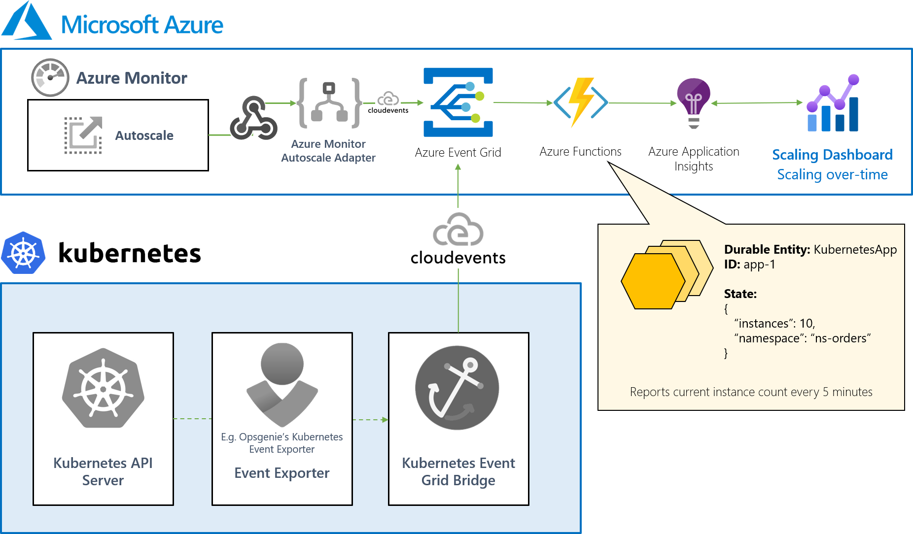

Leverage scaling-over-time dashboarding for your application autoscaling with Azure Durable Functions. 📊

For every application in your platform, a durable entity is available that allows you to:

- Receive CloudEvents for Azure Monitor Autoscale events (based on [Azure Event Grid adapter for Azure Monitor Autoscale
](https://github.com/tomkerkhove/azure-monitor-autoscale-to-event-grid-adapter))
- Automatically report current instance count every 5 minutes
- Get the current instance count for a given app

Here's a high-level overview:

